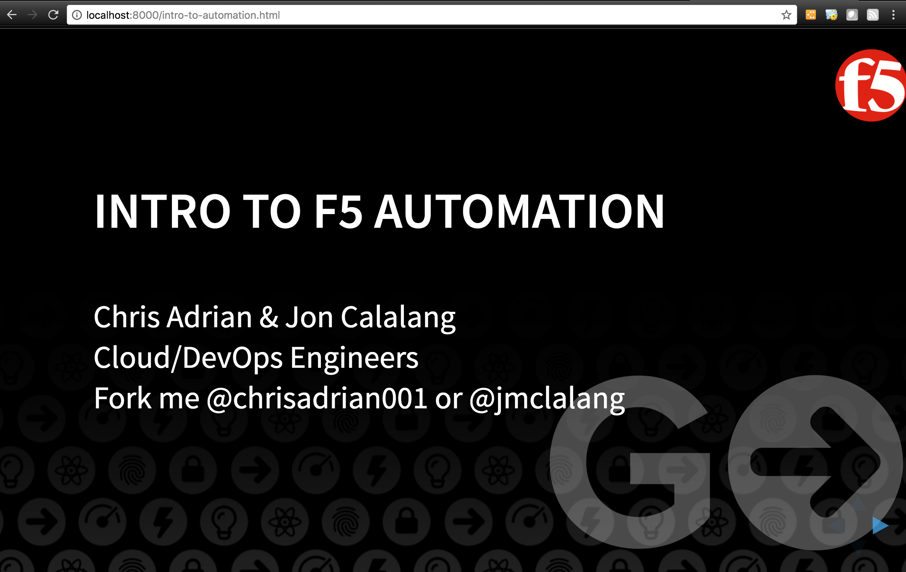

# Reveal.js
This tutorial was put together to provide a quick overview of the install and launch process for reveal.js presentations.
<br>
# Installing Node.js and Reveal.js
For the installation of Node.js, Reveal.js, and associated npm packages, we will be following instructions provided by hakimel in this reveal.js tutorial https://github.com/hakimel/reveal.js#markdown.<br>
<br>
To start, we need to install Node.js. Brows to https://nodejs.org/en/, download and install the appropriate version.
<br>
<br>
Installing Node.js:

<br>
<br>
Next, download the reveal.js package to a directory of your choice.  I am using my default home directory in this example.
```
git clone https://github.com/hakimel/reveal.js.git
```

<br>
<br>
Next you will need to install npm dependencies.<br>
```
cd reveal.js
npm install
```

<br>
<br>
Node.js, Reveal.js and  npm dependencies should now be installed.  At this point you can launch npn and view the default reveal presentation.
```
$ npm start
```
Open http://localhost:8000 to view your presentation.<br>
<br>
By default this will launch into port 8000.  Alternatively, you can specify the port with the "--port=x" switch.
```
npm start -- --port=8001
```

<br>
<br>
Now, to create or upload custom presentations for viewing.  To do this, simply create or copy an appropriate html file into the node.js directory.  In this example, I will pull the contents from: intro-to-automation.html from https://github.com/se314/rST/intro-to-automation/intro-to-automation.html.
```
vi intro-to-automation.html
```
Copy contents from intro-to-automation.html and save file.

<br>
<br>
You will also need to copy the image repository found in https://github.com/se314/rST/intro-to-automation/ to the node.js directory.


<br>
<br>
You can now view the intro-to-automation presentation by browsing to http://localhost:8000/intro-to-automation.html
```
http://localhost:8000/intro-to-automation.html
```

